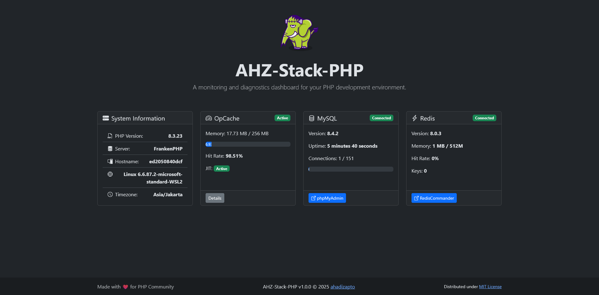

# 🚀 AHZ-Stack-PHP: Modern PHP Development Environment

<div align="center">



[](https://choosealicense.com/licenses/mit/)
[](https://php.net)
[](https://docker.com)
[](https://github.com)

**A complete, production-ready PHP development environment with integrated monitoring dashboard**

</div>

## ✨ Overview

AHZ-Stack-PHP is a comprehensive PHP development environment featuring modern tools and real-time monitoring capabilities. Built for developers who need a reliable, scalable, and secure development stack.

### 🛠️ Technology Stack

| Component               | Technology                   | Purpose                         |
| ----------------------- | ---------------------------- | ------------------------------- |
| 🌐**Web Server**  | Caddy + FrankenPHP           | High-performance PHP execution  |
| 🐘**Runtime**     | PHP 8.3+                     | Latest PHP with OPcache & Redis |
| 🗄️**Database**  | MySQL 8.4                    | Reliable data storage           |
| ⚡**Cache**       | Redis                        | In-memory caching & sessions    |
| 📊**Admin Tools** | phpMyAdmin + Redis Commander | Database & cache management     |
| 📈**Monitoring**  | Real-time Dashboard          | System performance tracking     |

## 🎯 Features

### 🏗️ **Production Ready**

- ✅ Security best practices implementation
- ✅ Performance optimized configurations
- ✅ SSL/TLS ready with automatic certificates
- ✅ Environment-based configuration management

### 💾 **Data Persistence**

- 📁 Local bind mounts for MySQL data
- 📁 Redis data persistence
- 📁 Caddy configuration storage
- 🔄 Automatic backup capabilities

### 🎛️ **Framework Support**

Dynamic framework switching via `.env` configuration:

- 🅰️ **Laravel** - The PHP Framework for Web Artisans
- 🎼 **Symfony** - High Performance PHP Framework
- 🔥 **CodeIgniter** - Small Footprint, Powerful Framework
- 🎨 **Custom** - Your own application structure

### 📊 **Real-time Monitoring Dashboard**

- 🖥️ **System Information**: PHP version, server details, OS info
- ⚡ **OpCache Status**: Memory usage, hit rates, JIT compilation
- 🗄️ **MySQL Metrics**: Version, uptime, connection statistics
- 📦 **Redis Analytics**: Memory usage, hit rates, key counts
- 🔄 **Auto-refresh**: Updates every 5 seconds

## 📋 Prerequisites

### 🐳 **Docker Environment** (Recommended)

- [Docker](https://docs.docker.com/get-docker/) 20.10+
- [Docker Compose](https://docs.docker.com/compose/install/) v2.0+

### 🖥️ **Local Development** (Alternative)

- PHP 8.3+ with extensions: OPcache, Redis, PDO-MySQL
- MySQL 8.4+
- Redis Server 6.0+

## 🚀 Quick Start

### 1. 📥 **Clone Repository**

```bash
git clone https://github.com/hadymaggot/ahz-stack-php.git
cd ahz-stack-php
```

### 2. ⚙️ **Environment Configuration**

```bash
# Copy environment template
cp .env.example .env

# Edit configuration
nano .env  # or your preferred editor
```

### 3. 🔧 **Essential Configuration**

Open `.env` and configure these critical settings:

```bash
# 🔐 Security Settings (MUST CHANGE FOR PRODUCTION)
MYSQL_ROOT_PASSWORD=your_strong_root_password
MYSQL_PASSWORD=your_strong_user_password
REDIS_PASSWORD=your_redis_password

# 🛡️ Admin Interface Security
REDIS_COMMANDER_USER=admin
REDIS_COMMANDER_PASSWORD=secure_admin_password

# 🎯 Framework Selection
PHP_FRAMEWORK=laravel  # Options: none, laravel, symfony, codeigniter
```

### 4. 🏗️ **Build & Launch**

#### 🐧 **Linux/macOS**

```bash
chmod +x scripts/build.sh
./scripts/build.sh
```

#### 🪟 **Windows**

```powershell
scripts\build.bat
```

#### 🐳 **Manual Docker Compose**

```bash
docker-compose up -d --build
```

## 🌐 Access Points

Once running, access your services:

| Service                     | URL                                           | Description               |
| --------------------------- | --------------------------------------------- | ------------------------- |
| 📊**Dashboard**       | [http://localhost](http://localhost)             | Main monitoring interface |
| 🗄️**phpMyAdmin**    | [http://pma.localhost](http://pma.localhost)     | Database management       |
| 📦**Redis Commander** | [http://redis.localhost](http://redis.localhost) | Cache management          |

> 📁 **Application Code**: Place your PHP files in the `www/` directory

## 🔐 Security Checklist

### ⚠️ **CRITICAL - Production Deployment**

Before deploying to production, complete this security checklist:

#### 1. 🔑 **Change Default Passwords**

- [ ] Strong MySQL root password
- [ ] Unique application database password
- [ ] Secure Redis password
- [ ] Complex admin interface credentials

#### 2. 🛡️ **Secure Admin Tools**

For production environments:

- [ ] **Remove admin tools** from `compose.yaml` (recommended)
- [ ] **Or secure with authentication**:
  ```bash
  # Generate secure basic auth
  scripts/generate-auth.sh    # Linux/macOS
  scripts/generate-auth.bat   # Windows
  ```

#### 3. 🔥 **Network Security**

- [ ] Configure host firewall (ports 80, 443 only)
- [ ] Set up VPN access for admin tools
- [ ] Implement IP whitelisting
- [ ] Use reverse proxy with SSL termination

#### 4. 📜 **SSL/HTTPS Configuration**

- [ ] Update `Caddyfile` with your domain
- [ ] Enable automatic SSL certificate generation
- [ ] Configure HSTS headers

#### 5. 💾 **Backup Strategy**

- [ ] Set up automated MySQL backups
- [ ] Configure Redis persistence
- [ ] Implement configuration backup

## 🎛️ Service Management

### 🔄 **Basic Operations**

```bash
# Start all services
docker-compose up -d

# Stop all services  
docker-compose down

# Restart specific service
docker-compose restart php

# View logs
docker-compose logs -f php
```

### 🧹 **Maintenance Commands**

```bash
# Stop and remove volumes (⚠️ DATA LOSS)
docker-compose down -v

# Rebuild specific service
docker-compose build --no-cache php

# Monitor resource usage
docker stats
```

## 🎯 Framework Integration

### 🔄 **Dynamic Framework Switching**

AHZ-Stack-PHP supports hot-swapping between popular PHP frameworks:

#### 1. **Framework Selection**

Edit `.env` file:

```bash
# Available options: none, laravel, symfony, codeigniter
PHP_FRAMEWORK=laravel
```

#### 2. **Auto-Configuration**

The system automatically:

- 📦 Installs the selected framework
- ⚙️ Configures database connections
- 🔗 Sets up Redis integration
- 📁 Creates appropriate directory structure

#### 3. **Framework-Specific Paths**

| Framework      | Directory                   | Auto-Config              |
| -------------- | --------------------------- | ------------------------ |
| 🅰️ Laravel   | `frameworks/laravel/`     | `.env` with DB & Redis |
| 🎼 Symfony     | `frameworks/symfony/`     | `.env.local` with DSN  |
| 🔥 CodeIgniter | `frameworks/codeigniter/` | `.env` with DB config  |

#### 4. **Real-time Detection**

- 🔄 Automatic change detection (5-second polling)
- 📢 Toast notifications for changes
- 🎯 Zero-downtime framework switching

## 🔧 Advanced Configuration

### 📊 **Performance Tuning**

#### MySQL Optimization

```yaml
# In compose.yaml - MySQL command
command: >
  --default-authentication-plugin=mysql_native_password
  --innodb-buffer-pool-size=512M
  --innodb-log-file-size=128M
  --max-connections=200
  --query-cache-size=64M
```

#### Redis Configuration

```bash
# In .env
REDIS_MAXMEMORY=512M
REDIS_MAXMEMORY_POLICY=allkeys-lru
```

#### PHP OpCache Settings

```ini
# In php/opcache.ini
opcache.memory_consumption=256M
opcache.interned_strings_buffer=16M
opcache.max_accelerated_files=20000
opcache.enable_cli=1
opcache.jit=on
```

### 🏗️ **Custom Development**

#### Adding New Frameworks

1. Create framework directory: `frameworks/your-framework/`
2. Add initialization logic in `src/Framework/FrameworkInitializer.php`
3. Update environment configuration
4. Test with build scripts

#### Extending Dashboard

The monitoring dashboard is modular:

- 📊 Add new metrics in `src/System/SystemInfo.php`
- 🎨 Customize UI in `www/templates/dashboard.php`
- 📡 Extend API in `src/Api/ApiController.php`

  Proses ini terjadi dalam dua tahap:

  1. **Saat Build**: Dockerfile.frankenphp membuat file `.env` framework dengan nilai dari variabel lingkungan.
  2. **Saat Runtime**: Script `init-framework.php` memperbarui file `.env` framework jika ada perubahan pada variabel lingkungan.

  Dengan pendekatan ini, Anda hanya perlu mengonfigurasi file `.env` di root project, dan konfigurasi framework akan dikelola secara otomatis.

## 🔍 Authentication & Security Tools

### 🔐 **Auth Generator**

Generate secure authentication credentials for admin interfaces:

#### 📝 **Usage**

```bash
# Windows
scripts\generate-auth.bat

# Linux/macOS  
chmod +x scripts/generate-auth.sh
./scripts/generate-auth.sh
```

#### ⚙️ **Configuration**

Ensure your `.env` contains:

```bash
# Admin Interface Credentials
REDIS_COMMANDER_USER=admin
REDIS_COMMANDER_PASSWORD=secure_password
```

#### 🛡️ **Security Features**

- 🔒 **BCrypt Hashing**: Password hashed with cost factor 10
- 💾 **Automatic Backup**: Creates timestamped Caddyfile backups
- 🔄 **Hot Reload**: Apply changes without container rebuild
- ✅ **Production Ready**: Secure authentication for admin tools

#### 📁 **Generated Files**

- `Caddyfile.backup.YYYY-MM-DD_HH-MM-SS` - Automatic backup
- Updated `Caddyfile` with secure basic auth blocks

## 🔧 Troubleshooting

### 🗄️ **MySQL Authentication Issues**

#### ❌ **Common Error**

```
Plugin 'mysql_native_password' is not loaded
```

#### ✅ **Automatic Fix**

AHZ-Stack-PHP includes automatic resolution:

- 🔧 MySQL 8.0+ compatibility layer
- 🔑 Automatic plugin configuration
- 📜 Initialization scripts for user setup

#### 🛠️ **Manual Fix** (if needed)

```sql
-- Connect to MySQL container
docker exec -it lemp-mysql mysql -u root -p

-- Fix authentication
ALTER USER 'lemp_user'@'%' IDENTIFIED WITH mysql_native_password BY 'userpassword';
ALTER USER 'root'@'%' IDENTIFIED WITH mysql_native_password BY 'rootpassword';
FLUSH PRIVILEGES;
```

#### ✅ **Verification**

```sql
SELECT user, host, plugin FROM mysql.user WHERE user IN ('root', 'lemp_user');
```

Expected output:

```
+----------+-----------+-----------------------+
| user     | host      | plugin                |
+----------+-----------+-----------------------+
| lemp_user| %         | mysql_native_password |
| root     | %         | mysql_native_password |
+----------+-----------+-----------------------+
```

### 🔧 **General Troubleshooting**

#### 🔍 **Debug Commands**

```bash
# Check service status
docker-compose ps

# View service logs
docker-compose logs -f [service_name]

# Test database connection
docker exec -it lemp-mysql mysql -u lemp_user -p lemp_db

# Check environment variables
docker exec lemp-mysql env | grep MYSQL
```

#### 📊 **Performance Issues**

```bash
# Monitor resource usage
docker stats

# Check MySQL performance
docker exec -it lemp-mysql mysql -u root -p -e "SHOW PROCESSLIST;"

# Redis memory usage
docker exec -it lemp-redis redis-cli INFO memory
```

## 🎯 Code Quality & Improvements

### ⚡ **Cache System Optimization**

#### 🔄 **Redis-Based Caching**

- **Performance**: 10-100x faster than file-based cache
- **Scalability**: Multi-instance support with shared cache
- **Reliability**: Built-in persistence and replication
- **TTL Support**: Automatic expiration management

#### 🏗️ **Implementation**

```php
// RedisCache class usage
RedisCache::set('key', 'value', 3600);  // Set with 1-hour TTL
$value = RedisCache::get('key', 'default');
RedisCache::increment('counter', 1);
RedisCache::flush();  // Clear all cache
```

### 🎨 **Enhanced User Experience**

#### 📢 **Toast Notifications**

- **Non-blocking**: User can continue working
- **Auto-dismiss**: Disappears after 10 seconds
- **Multiple instances**: Stack notifications
- **Modern design**: Bootstrap 5 with animations

#### 🔄 **Real-time Detection**

- **Hot-reload**: No container restart needed
- **5-second polling**: Quick change detection
- **Visual feedback**: Clear notification system
- **Backward compatible**: Maintains existing functionality

## 🤝 Contributing

We welcome contributions! Here's how to get started:

### 🛠️ **Development Setup**

1. 🍴 Fork the repository
2. 📥 Clone your fork
3. 🌿 Create a feature branch
4. 🔧 Make your changes
5. ✅ Test thoroughly
6. 📤 Submit a pull request

### 📝 **Guidelines**

- Follow PSR-12 coding standards
- Add tests for new features
- Update documentation
- Ensure backward compatibility

### 🐛 **Bug Reports**

When reporting bugs, include:

- Operating system and version
- Docker/Docker Compose version
- Steps to reproduce
- Expected vs actual behavior
- Relevant logs

## 📄 License

This project is licensed under the **MIT License** - see the [LICENSE](LICENSE) file for details.

### 📜 **MIT License Summary**

- ✅ **Commercial use** - Use in commercial projects
- ✅ **Modification** - Modify and distribute
- ✅ **Distribution** - Share with others
- ✅ **Private use** - Use for personal projects
- ❌ **Liability** - No warranty provided
- ❌ **Warranty** - Use at your own risk

## 👨‍💻 Credits & Acknowledgments

### 🚀 **Project Lead**

**Ahadizapto**

- 📧 Email: [9hs@tuta.io](mailto:9hs@tuta.io)
- 🌐 Website: [hadymaggot.github.io](https://hadymaggot.github.io)
- 💼 LinkedIn: [saptohadi](https://www.linkedin.com/in/saptohadi/)
- 🐙 GitHub: [hadymaggot](https://github.com/hadymaggot)

### 🙏 **Open Source Dependencies**

Special thanks to these amazing projects:

| Technology                  | Purpose                        | Website                                                      |
| --------------------------- | ------------------------------ | ------------------------------------------------------------ |
| 🐘**FrankenPHP**      | Modern PHP Application Server  | [frankenphp.dev](https://frankenphp.dev)                        |
| 🌐**Caddy**           | Automatic HTTPS Web Server     | [caddyserver.com](https://caddyserver.com)                      |
| 🗄️**MySQL**         | Reliable Database System       | [mysql.com](https://www.mysql.com)                              |
| ⚡**Redis**           | In-Memory Data Store           | [redis.io](https://redis.io)                                    |
| 🔧**phpMyAdmin**      | Web-based MySQL Administration | [phpmyadmin.net](https://www.phpmyadmin.net)                    |
| 📊**Redis Commander** | Redis Management Interface     | [Redis Commander](https://joeferner.github.io/redis-commander/) |
| 🎨**Bootstrap**       | Front-end Framework            | [getbootstrap.com](https://getbootstrap.com)                    |

## 📈 Roadmap

### 🎯 **Upcoming Features**

- 🔌 WebSocket integration for real-time updates
- 📱 Mobile-responsive admin interface
- 🔄 Auto-scaling container orchestration
- 📊 Advanced performance analytics
- 🛡️ Enhanced security scanning
- 🌍 Multi-language dashboard support

### 🤝 **Community Goals**

- 📚 Comprehensive documentation
- 🎓 Video tutorials and guides
- 🧪 Automated testing suite
- 🐳 Kubernetes deployment options
- 🔌 Plugin architecture for extensions

## 🆘 Support

### 💬 **Get Help**

- 📖 Check this documentation first
- 🐛 [Report issues](https://github.com/hadymaggot/ahz-stack-php/issues)
- 💡 [Request features](https://github.com/hadymaggot/ahz-stack-php/discussions)
- 📧 Email: [9hs@tuta.io](mailto:9hs@tuta.io)

### ❤️ **Show Your Support**

If this project helps you, please consider:

- ⭐ **Star** this repository
- 🍴 **Fork** and contribute
- 📢 **Share** with others
- 💝 **Sponsor** development

---

<div align="center">

**Built with ❤️ by [Ahadizapto](https://github.com/hadymaggot)**

[](https://github.com/hadymaggot/ahz-stack-php)
[](https://github.com/hadymaggot/ahz-stack-php/fork)

*Ready to revolutionize your PHP development experience?* 🚀

</div>
